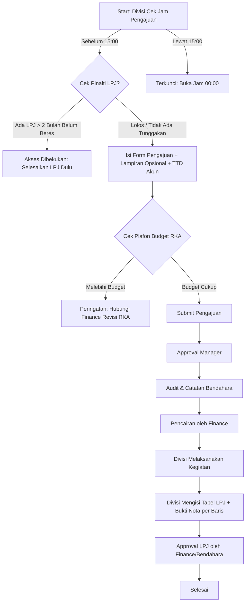
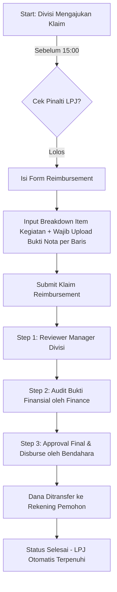

# Spesifikasi & Analisis Revisi Alur Proses Bisnis
**Sistem Informasi Pengajuan Dana & LPJ (Finance Fund)**  
*Dokumen ini menyajikan analisis mendalam dan pemetaan teknis terhadap 11 poin revisi alur proses bisnis.*

---

## Daftar Isi
1. [Ringkasan Perubahan](#1-ringkasan-perubahan)
2. [Penjelasan Rinci 11 Poin Revisi](#2-penjelasan-rinci-11-poin-revisi)
   - [Poin 1: Bukti Invoice di Setiap Item LPJ (Tanpa Berkas LPJ Global)](#poin-1-bukti-invoice-di-setiap-item-lpj-tanpa-berkas-lpj-global)
   - [Poin 2: Kebijakan Punishment / Pembekuan Pengajuan (LPJ > 2 Bulan)](#poin-2-kebijakan-punishment--pembekuan-pengajuan-lpj--2-bulan)
   - [Poin 3: Dukungan Paste File Clipboard (Ctrl + V)](#poin-3-dukungan-paste-file-clipboard-ctrl--v)
   - [Poin 4: Tanda Tangan Digital Tergenerate Berdasarkan Akun](#poin-4-tanda-tangan-digital-tergenerate-berdasarkan-akun)
   - [Poin 5: Fitur Laporan - Voucher Detail History Audit](#poin-5-fitur-laporan---voucher-detail-history-audit)
   - [Poin 6: Kontrol Anggaran RKA (Over-Budget Handling)](#poin-6-kontrol-anggaran-rka-over-budget-handling)
   - [Poin 7: Lampiran Pendukung Opsional di Semua Form Pengajuan](#poin-7-lampiran-pendukung-opsional-di-semua-form-pengajuan)
   - [Poin 8: Penggabungan Form Awal Reimbursement dengan LPJ](#poin-8-penggabungan-form-awal-reimbursement-dengan-lpj)
   - [Poin 9: Granularitas Sub-Detail Item & Bukti Nota Reimbursement](#poin-9-granularitas-sub-detail-item--bukti-nota-reimbursement)
   - [Poin 10: Rekayasa Alur Approval Reimbursement (Manager ➔ Finance ➔ Bendahara)](#poin-10-rekayasa-alur-approval-reimbursement-manager--finance--bendahara)
   - [Poin 11: Pembatasan Waktu Pengajuan (Cut-Off Time 15:00 - 00:00)](#poin-11-pembatasan-waktu-pengajuan-cut-off-time-1500---0000)
3. [Matriks Perbandingan: Alur Lama vs Alur Baru](#3-matriks-perbandingan-alur-lama-vs-alur-baru)
4. [Diagram Alur Proses Bisnis Baru](#4-diagram-alur-proses-bisnis-baru)
5. [Dampak Komponen & Rencana Implementasi](#5-dampak-komponen--rencana-implementasi)

---

## 1. Ringkasan Perubahan

Revisi proses bisnis ini berfokus pada 4 pilar utama:
1. **Peningkatan Akuntabilitas & Audit Trail**: Bukti transaksi melekat langsung pada baris item belanja, laporan berbentuk voucher resmi kas/bank, dan pencatatan riwayat audit persetujuan yang terperinci.
2. **Disiplin Anggaran & Kepatuhan Administrasi**: Adanya sanksi pembekuan pengajuan jika terdapat LPJ menunggak 2 bulan, validasi pagu anggaran RKA secara ketat, serta pemberlakuan jam *cut-off* harian (15:00 WIB).
3. **Efisiensi & Khusus Alur Reimbursement**: Menghilangkan duplikasi proses pada reimbursement karena pengeluaran sudah terjadi di masa lampau (pengajuan sekaligus LPJ) dengan urutan persetujuan khusus: *Manager ➔ Finance Reviewer ➔ Bendahara Disburser*.
4. **Modernisasi UI/UX**: Otomasi tanda tangan dari profil akun login, dukungan *paste screenshot/file* (`Ctrl + V`) pada seluruh area upload, serta lampiran pendukung opsional di semua formulir.

---

## 2. Penjelasan Rinci 11 Poin Revisi

### Poin 1: Bukti Invoice di Setiap Item LPJ (Tanpa Berkas LPJ Global)
* **Kondisi Sebelumnya**: Form LPJ mengharuskan pengguna mengunggah satu berkas bundel PDF LPJ di luar tabel (`LpjUrl`). Hal ini menyulitkan tim audit saat ingin mencocokkan nota spesifik dengan baris pengeluaran tertentu.
* **Aturan Baru**:
  - Pengunggahan berkas gabungan di header form LPJ ditiadakan.
  - Setiap baris transaksi belanja pada tabel LPJ wajib/dapat memiliki file bukti invoice/nota/struk masing-masing.
* **Dampak Teknis & Data**:
  - Pada interface `DetailItemLPJ`, ditambahkan atribut:
    ```typescript
    export interface DetailItemLPJ {
      // ... field lama
      buktiUrl?: string;
      buktiNama?: string;
    }
    ```
  - Form tabel input LPJ menambahkan kolom aksi **"Upload/Lihat Bukti"** pada setiap baris item pengeluaran (kredit).

---

### Poin 2: Kebijakan Punishment / Pembekuan Pengajuan (LPJ > 2 Bulan)
* **Aturan Bisnis**:
  - Jika suatu divisi memiliki pengajuan yang telah dicairkan (`status === 'disetujui'`) lebih dari **2 bulan kalender** yang lalu, namun status LPJ-nya masih belum tuntas (`status === 'belum_lpj'` atau `'ditolak'`), maka sistem akan membekukan hak divisi tersebut untuk membuat pengajuan dana baru (`/pengajuan/create`).
* **Mekanisme Sistem**:
  1. Helper validasi: `checkDivisiEligibility(divisiId)`.
  2. Formula: `selisihBulan(tanggalSekarang, lpj.tanggalCair) >= 2 && lpj.status !== "disetujui"`.
  3. Jika terindikasi ada pelanggaran:
     - Halaman `/pengajuan/create` menampilkan **Lockout Banner / Peringatan Merah**.
     - Tombol "Buat Pengajuan Baru" di seluruh tabel dinonaktifkan dengan tooltip penjelasan.
     - Disediakan tombol jalan pintas langsung: *"Selesaikan LPJ Tertunggak [No Pengajuan]"*.

---

### Poin 3: Dukungan Paste File Clipboard (`Ctrl + V`)
* **Kebutuhan Pengguna**: Tim divisi sering kali mengambil tangkapan layar (*screenshot*) bukti transfer m-banking, invoice WhatsApp, atau nota digital dengan *Snipping Tool*. Menyimpan berkas ke disk lalu membrowsingnya membuang waktu.
* **Implementasi Fitur**:
  - Seluruh komponen upload berkas (Dropzone, input file lampiran, dan upload bukti tabel) dilengkapi event listener `onPaste`.
  - Sistem mendeteksi `event.clipboardData.items`:
    - Jika terdapat file berformat gambar (`image/png`, `image/jpeg`, dll.) atau dokumen (`application/pdf`), otomatis dikonversi menjadi `File` object dan langsung masuk ke daftar file terunggah.

---

### Poin 4: Tanda Tangan Digital Tergenerate Berdasarkan Akun
* **Kondisi Sebelumnya**: Pengguna harus menggambar tanda tangan di kanvas manual atau mengunggah gambar tanda tangan di setiap form.
* **Aturan Baru**:
  - Setiap akun pengguna memiliki spesimen tanda tangan / paraf resmi yang tersimpan di data profil akun (`user.tandaTanganUrl` / SVG signature badge / QR otentikasi).
  - Saat form dibuat atau disetujui pada step tertentu, sistem otomatis mencantumkan tanda tangan digital dan nama terang pengguna yang sedang aktif (*session user*), sehingga pengesahan instan, seragam, dan anti-pemalsuan.

---

### Poin 5: Fitur Laporan - Voucher Detail History Audit
* **Kebutuhan Bisnis**: Divisi audit dan akuntansi membutuhkan dokumen cetak resmi berbentuk **Voucher Pengeluaran Kas/Bank (Disbursement Voucher)** untuk arsip fisik pembukuan.
* **Komponen Voucher**:
  1. **Kop & Metadata**: No. Voucher, Tanggal, Mata Anggaran (COA), Jenis Pengajuan.
  2. **Rincian Finansial**: Uraian belanja, nominal pengajuan, nominal disetujui/dicairkan, dan rekening tujuan transfer.
  3. **Audit Trail Lengkap (Matriks Pengesahan)**:
     - Dibuat oleh: Nama Divisi & Waktu submit.
     - Disetujui Manager: Nama Manager, Waktu, Status, Catatan approval.
     - Diaudit Bendahara: Nama Bendahara, Waktu, Catatan audit nominal.
     - Dicairkan Finance: Nama Finance, Waktu, Bank transfer & No. Referensi transaksi.
  4. Tersedia tombol **Cetak (Print View)** dan **Ekspor PDF** berformat A4 standar voucher akuntansi.

---

### Poin 6: Kontrol Anggaran RKA (Over-Budget Handling)
* **Aturan Bisnis**:
  - Pengajuan berjenis **RKA** tidak boleh melebihi sisa anggaran (*remaining budget*) pada kelompok kegiatan RKA yang dipilih.
* **Validasi Interaktif**:
  - Pada saat memilih kegiatan RKA dan memasukkan nominal:
    - Jika `nominalPengajuan > sisaBudget`:
      - Muncul modal peringatan / alert kontekstual:  
        *"Nominal pengajuan (Rp X) melebihi sisa anggaran RKA yang tersedia (Rp Y). Silakan hubungi Divisi Finance untuk mengajukan revisi RKA atau kebijakan anggaran khusus."*
      - Tombol submit form dikunci (*disabled*) hingga nominal disesuaikan atau pengajuan dialihkan ke prosedur khusus yang disetujui Finance.

---

### Poin 7: Lampiran Pendukung Opsional di Semua Form Pengajuan
* **Aturan Bisnis**:
  - Seluruh formulir pengajuan dana (RKA, Perjalanan Dinas, Reimbursement, Insidental) menyediakan bagian pengunggahan berkas pendukung (misal: Kerangka Acuan Kerja/TOR, Surat Tugas, Memo Permohonan).
  - Sifat berkas ini adalah **Opsional** (*tidak mandatory*).
  - Mendukung format: `.pdf`, `.jpg`, `.jpeg`, `.png` dengan dukungan *paste* dari clipboard.

---

### Poin 8: Penggabungan Form Awal Reimbursement dengan LPJ
* **Filosofi Keuangan**:
  - Pada pengajuan biasa (RKA/Jaldis/Insidental): Dana dicairkan di muka ➔ Belanja ➔ Terbit LPJ.
  - Pada Reimbursement: Belanja sudah terjadi memakai uang talangan ➔ Pemohon membawa bukti nota ➔ Meminta penggantian dana.
* **Perubahan Alur**:
  - Pada Reimbursement, **Form Pengajuan awal secara otomatis berfungsi sebagai LPJ**.
  - Begitu reimbursement disetujui dan dicairkan oleh Bendahara/Finance, transaksi dinyatakan **SELESAI (LPJ Otomatis Terpenuhi)**.
  - Pemohon tidak perlu lagi membuat dokumen LPJ terpisah di menu LPJ di kemudian hari.

---

### Poin 9: Granularitas Sub-Detail Item & Bukti Nota Reimbursement
* **Struktur Data Form Reimbursement**:
  - Formulir Reimbursement mewajibkan rincian bertingkat (*parent-child breakdown*):
    - **Kegiatan Utama**: Misal *"Kunjungan Lapangan Vendor A"*.
    - **Daftar Sub-Item Belanja**:
      - Uraian belanja (misal: Bahan Bakar, Tol, Parkir, Jamuan Makan).
      - Kuantitas & Satuan.
      - Nominal Biaya.
      - **Wajib Melampirkan Bukti Transaksi** (Foto nota/struk/kuitansi digital) untuk masing-masing baris belanja.

---

### Poin 10: Rekayasa Alur Approval Reimbursement (Manager ➔ Finance ➔ Bendahara)
* **Urutan Alur Standar Pengajuan Umum**:
  $$\text{Divisi} \longrightarrow \text{Manager} \longrightarrow \text{Bendahara} \longrightarrow \text{Finance (Pencairan)}$$
* **Urutan Khusus Reimbursement**:
  $$\text{Divisi} \longrightarrow \text{Manager (Review Divisi)} \longrightarrow \text{Finance (Audit Bukti Nota)} \longrightarrow \text{Bendahara (Persetujuan & Pencairan)}$$
* **Alasan Bisnis**:
  - Bukti transaksi dan nota fisik sudah ada di awal.
  - Finance bertindak sebagai *Auditor Reviewer* untuk memverifikasi keaslian nota, kuitansi, dan kesesuaian pajak/anggaran.
  - Bendahara bertindak sebagai *Otorisator Akhir* yang menyetujui dan mengesahkan pembayaran dana penggantian kembali ke rekening pemohon.

---

### Poin 11: Pembatasan Waktu Pengajuan (Cut-Off Time 15:00 - 00:00)
* **Aturan Operasional Kas Harian**:
  - **Jam Buka Sistem Pengajuan**: **00:00:00 WIB** setiap hari.
  - **Jam Tutup (*Cut-Off Time*)**: Tepat pukul **15:00:00 WIB**.
  - **Periode Pembekuan (*Freeze Window*)**: Pukul **15:00:01 s/d 23:59:59 WIB**.
* **Perilaku Sistem di Luar Jam Operasional**:
  - Banner informasi waktu operasional aktif di halaman Pengajuan.
  - Jika pengguna mengakses form pembuatan pengajuan baru setelah pukul 15:00:
    - Form ditampilkan dalam mode baca (*read-only*) atau menampilkan layar informasi cut-off:  
      *"Pengajuan dana hari ini telah ditutup pukul 15:00 WIB untuk proses rekonsiliasi harian. Anda dapat membuat pengajuan kembali mulai pukul 00:00 WIB."*
    - Tombol simpan/kirim pengajuan dinonaktifkan.
  - Pengajuan yang sudah disubmit sebelum jam 15:00 tetap dapat diproses/diapprove oleh pejabat terkait pada jam kerja normal.

---

## 3. Matriks Perbandingan: Alur Lama vs Alur Baru

| Fitur / Parameter | Alur Lama | Alur Baru |
| :--- | :--- | :--- |
| **Lampiran Berkas LPJ** | Upload berkas bundel PDF tunggal di luar tabel. | Bukti invoice/nota melekat pada setiap baris item pengeluaran LPJ. |
| **Sanksi Keterlambatan LPJ** | Hanya indikator badge status "Belum LPJ". | **Sanksi Tegas**: Pengajuan baru dibekukan jika LPJ > 2 bulan belum disetujui. |
| **Metode Input Bukti/File** | Hanya drag-and-drop & file picker lokal. | Mendukung **Paste File (`Ctrl + V`)** langsung dari screenshot clipboard. |
| **Tanda Tangan Pengesahan** | Upload manual atau gambar canvas tanda tangan. | **Otomatis tergenerate** dari spesimen profil akun yang sedang login. |
| **Laporan Pengeluaran** | Tabel ringkasan & detail biasa. | **Voucher Kas/Bank Resmi** dengan riwayat audit trail lengkap (Manager, Bendahara, Finance). |
| **Validasi Pagu RKA** | Tidak ada peringatan tegas over-budget. | Validasi real-time: wajib hubungi Finance untuk revisi RKA/kebijakan khusus jika over-budget. |
| **Lampiran Dokumen Pengajuan**| Hanya ada di jenis tertentu. | **Tersedia di semua form pengajuan** (PDF/Gambar, opsional). |
| **Siklus Reimbursement** | Mengajukan ➔ Pencairan ➔ Bikin LPJ terpisah. | **Pengajuan awal = Dokumen LPJ**. Selesai cair = LPJ otomatis tuntas. |
| **Bukti Nota Reimbursement** | Gabungan di dokumen pendukung umum. | **Per baris rincian kegiatan wajib melampirkan bukti nota** masing-masing. |
| **Alur Approval Reimburse** | Manager ➔ Bendahara ➔ Finance. | **Manager ➔ Finance Reviewer ➔ Bendahara (Final Disburser)**. |
| **Waktu Operasional Pengajuan** | Bebas 24 jam tanpa batasan. | Dibatasi **Cut-off pukul 15:00 WIB** (buka kembali jam 00:00 WIB). |

---

## 4. Diagram Alur Proses Bisnis Baru

### A. Alur Pengajuan Dana Reguler (RKA, Jaldis, Insidental)


### B. Alur Khusus Reimbursement (One-Step Claim & LPJ)


---

## 5. Dampak Komponen & Rencana Implementasi

| Area / Modul | File Terkait | Rencana Perubahan Teknis |
| :--- | :--- | :--- |
| **Komponen Upload** | `src/components/ui/FileUpload.tsx` atau Dropzone | Pasang handler `onPaste` untuk membaca `clipboardData.files`. |
| **Aturan Cut-off Time** | `src/lib/utils/cutoff.ts`, `FormPengajuanShell.tsx` | Helper pengecekan waktu lokal server (00:00 - 15:00), banner peringatan cut-off. |
| **Validasi Sanksi LPJ** | `src/features/lpj/services/lpj.service.ts`, `page.tsx` | Method `checkDivisiEligibility()`, banner pembekuan form jika LPJ > 2 bulan tertunggak. |
| **Tabel Rincian LPJ** | `FormLPJItemsTable.tsx`, `lpj/types/index.ts` | Hapus input bundle LPJ global, tambah kolom upload/view bukti nota per baris item. |
| **Form Reimbursement** | `usePengajuanForm.ts`, `PengajuanFormLayout.tsx` | Sub-tabel rincian nota & lampiran per baris, bypass alur modul LPJ sekunder. |
| **Alur Approval (RBAC)**| `pengajuanService.factory.ts`, `divisiPengajuan.service.ts` | Step Reimbursement: `manager ➔ finance ➔ bendahara ➔ selesai`. |
| **Laporan Voucher** | Modul baru `src/features/laporan/components/PaymentVoucher.tsx` | Format slip voucher resmi A4 dengan matriks audit trail dan spesimen TTD otomatis. |
| **Validasi Budget RKA** | `RKATableSection.tsx`, `usePengajuanForm.ts` | Dialog peringatan over-budget dan penguncian submit bila melebihi pagu. |

---
*Dokumen ini disusun sebagai acuan arsitektur sistem dan kesepakatan spesifikasi fungsional tahap lanjutan.*
